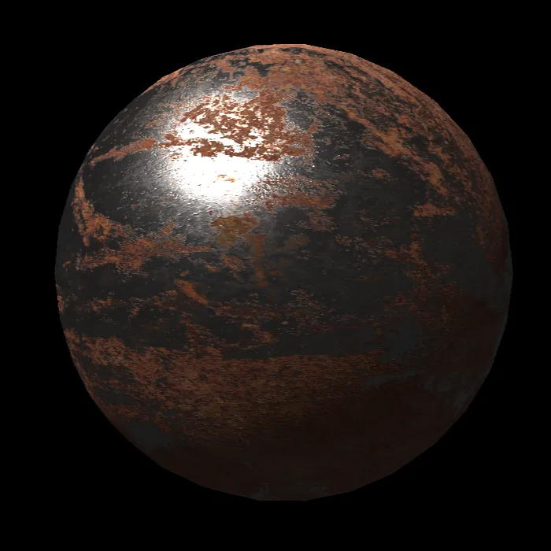
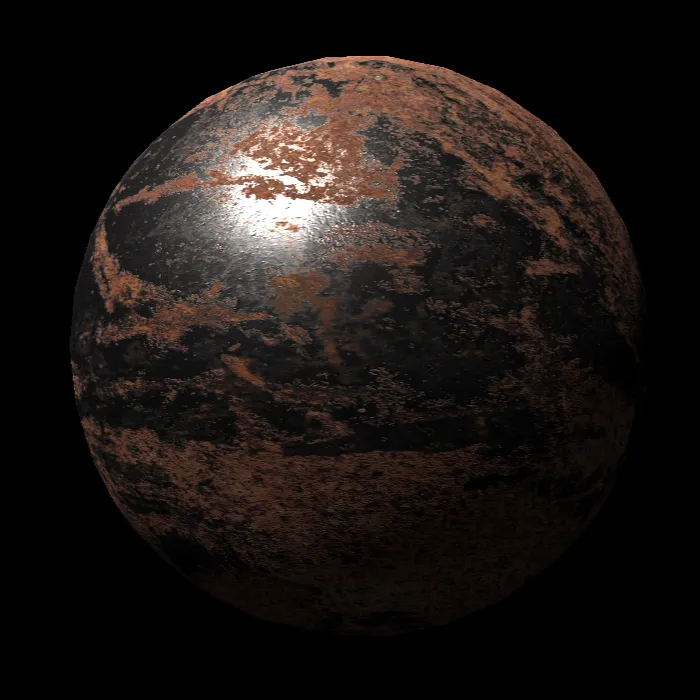

# PBR

PBR的Unity实现

1) BRDF + 简单环境光
2) BRDF + (光照贴图+反射探针+SH)

Unity implementation of PBR

1) BRDF + Simple Ambient Light
2) BRDF + (Light Mapping + Reflection Probe + SH)

Unity Version：2022.3.40f1c1

|||
|:---:|:---:|
|BRDF + Simple Ambient Light|UnityPBR|

